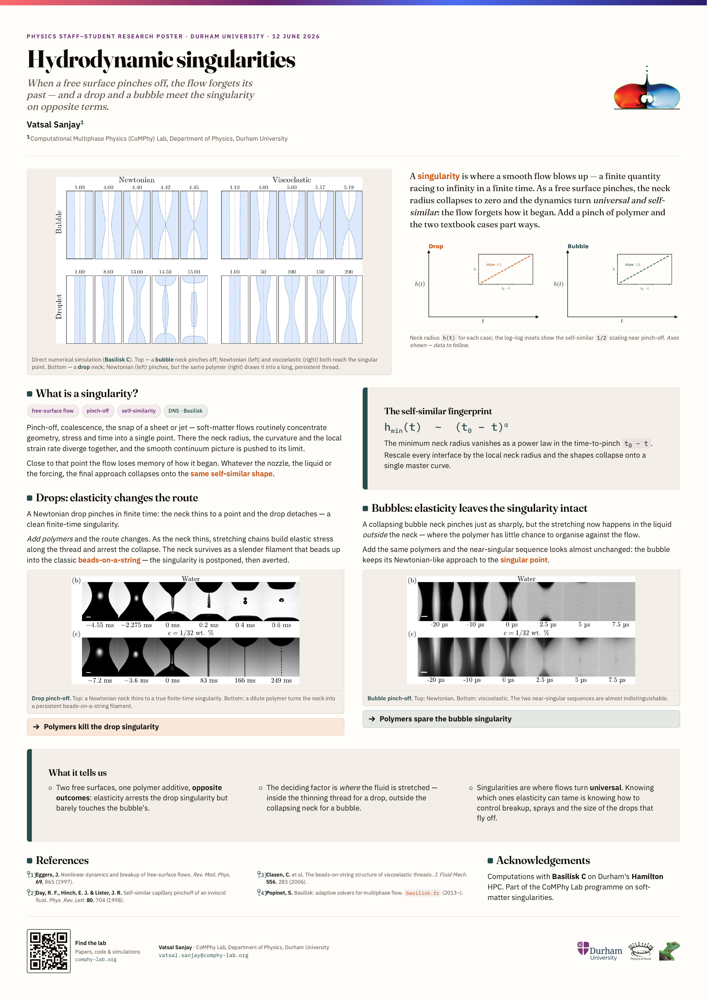

# Hydrodynamic Singularities — A0 poster

A student-facing A0 poster on hydrodynamic singularities, built on the
**CoMPhy Lab design system**. Made for the Durham Physics Staff–Student Research
Poster Event, 12 June 2026.

The story: a singularity is where a smooth free-surface flow blows up and
forgets its past — and near it the dynamics turn universal and self-similar. The
poster contrasts the two textbook cases — **drop** pinch-off, where a little
polymer kills the singularity (beads-on-a-string), and **bubble** pinch-off,
where the same polymer leaves it intact.



## How it's built

The poster is **HTML/CSS** on the lab design system; a small **TypeScript**
layer holds the content and renders it; **Python** is the driver that turns it
into print-ready A0 artifacts.

```
design-system/   CoMPhy Lab system, vendored from the design handoff (source of truth)
  tokens.css       colours, type, spacing
  poster.css       A0 academic-poster layout
  poster-fit.js    on-screen scaling (print prints 1:1 at A0)
src/             the poster, as typed data + a renderer
  content.ts       ← EDIT THIS for wording, figures, references
  types.ts         the content model
  poster.ts        content → design-system HTML
  build.ts         inlines CSS/JS + images → standalone outputs/poster.html
scripts/
  make_poster.py   ← THE DRIVER: QR → build → A0 PDF → PNG
assets/          logos + the real science figures (experimental + numerical crops)
outputs/         poster.html (editable-source-of-truth-free, standalone), PDF, PNG
```

### One command

```bash
make            # QR → build HTML → true-A0 PDF + PNG preview
# or
python3 scripts/make_poster.py
```

Artifacts land in `outputs/`:

- `hydrodynamic_singularities_poster.pdf` — **print this** (true A0, 841 × 1189 mm).
- `hydrodynamic_singularities_poster.png` — quick preview.
- `poster.html` — standalone (CSS/JS/images inlined); opens & prints from any browser.

### Editing the content

Everything you'd change for a content pass lives in
[`src/content.ts`](src/content.ts) — title, authors, the three sections,
figures, the scaling breadcrumb, references, the QR target. Then rebuild:

```bash
make            # or: make html   (HTML only, no render)
```

Layout and any system-level styling live in [`src/poster.ts`](src/poster.ts) and
[`design-system/`](design-system/) respectively.

## Requirements

| Tool | For | Notes |
|---|---|---|
| Python 3.10+ | the driver | always required |
| Google Chrome (or Chromium/Edge) | A0 PDF + PNG | render engine; honours `@page` size |
| Node 18+ | the TS build | `make setup` once to install `tsx` |
| `pdftoppm` (poppler) | crisp PNG | optional; falls back to Chrome screenshot, then `sips` |
| `uv` or `qrcode[pil]` | the QR code | optional; falls back to a placeholder |

The pipeline degrades gracefully: with no Node it renders the committed
`outputs/poster.html`; with no `pdftoppm` it screenshots; with no QR tooling it
uses the design system's finder-pattern placeholder.

```bash
make setup      # npm install (tsx + typescript), one-off
make            # full build + render
make pdf        # re-render PDF from existing HTML (no Node needed)
make landscape  # landscape A0 variant
make typecheck  # tsc --noEmit
```

If no Chrome is found, open `outputs/poster.html` and use the in-page
**“Print / Save PDF · A0”** button.

## Design system

`design-system/` is the CoMPhy Lab visual language, vendored verbatim from the
Claude Design handoff — see [`design-system/README.md`](design-system/README.md).
Treat it as upstream. The non-negotiables: warm paper (not white), one teal
accent, the brand gradient only as the top signature bar, a solid-ink title for
2-metre legibility, and the three type roles (Cormorant hero, Fraunces headings,
IBM Plex body/mono).

## Notes

- The hero **h(t) scaling plots** are generated by
  `scripts/make_scaling_plots.py` (run via `uv run --with matplotlib python3 …`
  or any env with matplotlib). They ship as schematic axes with the slope-½
  inset; drop real neck-radius data into the marked block and rerun to fill them.
- **References** in `src/content.ts` are canonical starting points
  (Eggers 1997; Day–Hinch–Lister 1998; Clasen 2006; Basilisk) — verify and
  curate before printing.
- Webfonts load from Google Fonts at render time, so the first render needs a
  network connection.
